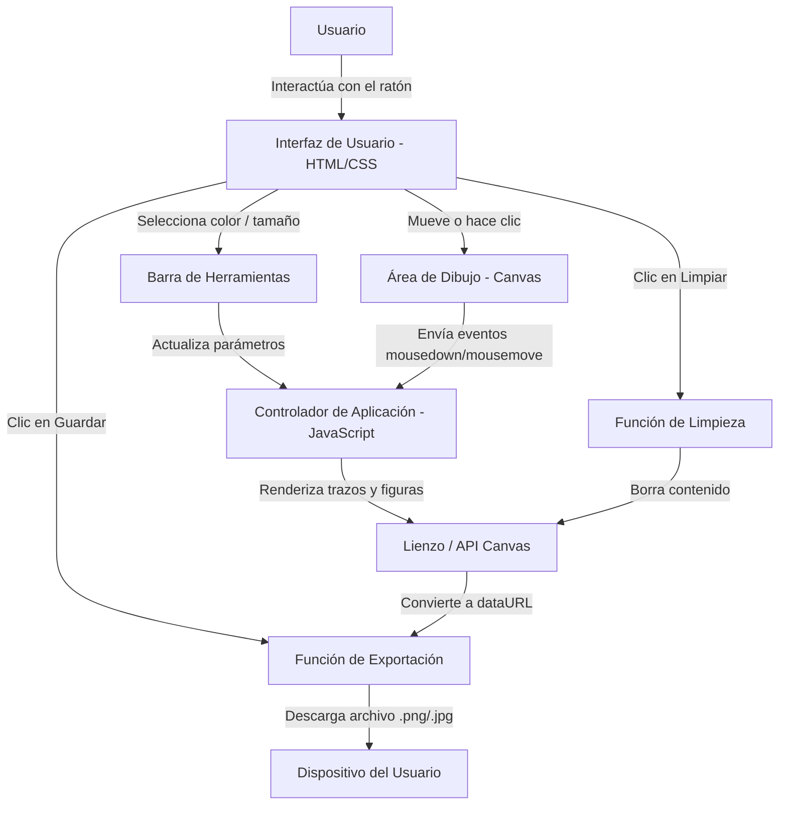

# App-de-Dibujo
## Descripción
Aplicación web que permite a los usuarios crear obras de arte digitales sobre un lienzo interactivo, ajustar herramientas de dibujo y exportar el resultado como imagen.
## Justificación del proyecto
Elegí esta idea y este proyecto porque al verlo a simple vista la lista de ideas, ver una aplicación de dibujo me llamó la atención y quise intentar a ver cómo se podía crear. También porque el hecho de que era interesante, y también por el que se veía sencillo, lo escogí y pues también me llamó la atención el dibujo de una app al estilo Paint y estoy satisfecho del proyecto, y me gustó el resultado final.
## Metodologia
Usaremos el enfoque Ágil (Kanban) con un tablero de tres columnas (Hacer, En Proceso, Hecho) para gestionar entregas incrementales y adaptar la interfaz del lienzo según nuestro avance.
## User Stories
- Como usuario, quiero dibujar en el lienzo con el ratón para crear trazos interactivos.
- Como usuario, quiero cambiar el color del pincel para personalizar el diseño.
- Como usuario, quiero cambiar el tamaño del pincel para realizar trazos finos o gruesos.
- Como usuario, quiero presionar un botón para limpiar el lienzo y reiniciar el dibujo.
- Como usuario, quiero guardar el dibujo como imagen (.png o .jpg) en mi dispositivo.
- Como usuario, quiero insertar formas geométricas (rectángulos y círculos) en el lienzo.0
#### Integrantes
- Diego Fernández Mendoza — fernandezmendozadiego@gmail.com
## Diagrama del Sistema

